# 🔄 Flow Aplikasi HCM - Dokumentasi Lengkap dengan Flowchart

## 📋 Daftar Isi
1. [Overview Flow Aplikasi](#overview-flow-aplikasi)
2. [Flow Cassette Repair (Main Flow)](#flow-cassette-repair-main-flow)
3. [Flow Preventive Maintenance](#flow-preventive-maintenance)
4. [Flow Replacement Cassette](#flow-replacement-cassette)
5. [User Role Hierarchy](#user-role-hierarchy)
6. [Flow Detail per Modul](#flow-detail-per-modul)
7. [Flowchart Diagram](#flowchart-diagram)
8. [Status Flow Diagram](#status-flow-diagram)

---

## 🎯 Overview Flow Aplikasi

### Flow Utama: Cassette Repair Process

```
Pengelola (Vendor) → Buat Ticket → Input Form Pengiriman → 
Repair Center Terima → Repair & QC → Kirim Kembali → 
Pengelola Terima → Selesai
```


**Aktor yang Terlibat:**
- **Pengelola (Vendor)**: Field technician yang mengelola mesin di bank
- **Repair Center (RC) Staff**: Staff Hitachi yang memperbaiki kaset

**Tidak Ada:**
- ❌ Approve ticket oleh admin
- ❌ Swap kaset langsung
- ❌ Spare pool management

---

## 🔄 Flow Cassette Repair (Main Flow)

### Step-by-Step Flow

#### **STEP 1: Pengelola Buat Problem Ticket** 📝

**Aktor:** Pengelola (Vendor Technician)

**Action:**
1. Pengelola mengidentifikasi kaset rusak di mesin
2. Login ke sistem sebagai vendor user
3. Navigate ke `/tickets/create`
4. Isi form ticket:
   - Pilih mesin yang terkena
   - Input/scan serial number kaset (opsional untuk multi-cassette ticket)
   - Judul masalah
   - Deskripsi detail
   - Priority (LOW/MEDIUM/HIGH/CRITICAL)
   - Metode pengiriman (kurir/antar langsung)
   - Info kurir (jika pakai kurir)
5. Submit ticket

**Status Ticket:** `OPEN` → `IN_DELIVERY` (jika langsung input delivery)

**Status Cassette:** `OK` atau `BAD` → `IN_TRANSIT_TO_RC` (setelah delivery dibuat)

**Catatan:** Kaset yang terpasang di mesin menggunakan status `OK` (jika kondisi baik) atau `BAD` (jika rusak). Tracking posisi kaset di mesin dilakukan melalui field `machineId` dan `usageType` (MAIN/BACKUP), bukan melalui status.

**System Actions:**
- Generate ticket number (format: `TKT-YYYYMMDD-XXXX`)
- Link ticket ke machine
- Log reporter (vendor user)
- Jika input delivery langsung, update cassette status

---

#### **STEP 2: Pengelola Input Form Pengiriman** 📦

**Aktor:** Pengelola (Vendor Technician)

**Action:**
1. Setelah ticket dibuat, pengelola buka form pengiriman
2. Navigate ke `/tickets/[id]/delivery`
3. Isi form pengiriman:
   - Pilih kaset yang dikirim (jika multi-cassette, bisa pilih beberapa)
   - Tanggal pengiriman
   - Jasa kurir (JNE, TIKI, Pos Indonesia, dll)
   - Nomor resi/tracking number
   - Estimasi tiba di RC
   - Alamat pengirim (jika tidak pakai alamat kantor)
   - Catatan tambahan
4. Submit form pengiriman

**Status Ticket:** `OPEN` → `IN_DELIVERY`

**Status Cassette:** `OK` atau `BAD` → `IN_TRANSIT_TO_RC`

**System Actions:**
- Create `CassetteDelivery` record
- Update cassette status ke `IN_TRANSIT_TO_RC`
- Update ticket status ke `IN_DELIVERY`
- Remove cassette dari machine (set machineId = null)

---

#### **STEP 3: RC Staff Terima Kaset di RC** 📬

**Aktor:** RC Staff (Hitachi)

**Action:**
1. Kaset fisik tiba di Repair Center
2. RC Staff login ke sistem
3. Navigate ke `/tickets/[id]/receive`
4. Scan atau input serial number kaset
5. Verifikasi dengan delivery form dari vendor
6. Konfirmasi penerimaan dengan optional notes
7. Submit receive

**Status Ticket:** `IN_DELIVERY` → `RECEIVED`

**Status Cassette:** `IN_TRANSIT_TO_RC` (masih sama, belum berubah)

**System Actions:**
- Update `CassetteDelivery` record (receivedAtRc, receivedBy)
- Update ticket status ke `RECEIVED`
- **Catatan:** Cassette status masih `IN_TRANSIT_TO_RC`, belum berubah ke `IN_REPAIR`
- **Catatan:** Repair ticket belum dibuat, harus dibuat manual oleh RC Staff

---

#### **STEP 4: RC Staff Create Repair Ticket** 🔧

**Aktor:** RC Staff (Hitachi)

**Action:**
1. Setelah kaset diterima, RC Staff buat repair ticket
2. Navigate ke ticket detail page
3. Klik "Mulai Repair" atau "Create Repair Ticket"
4. System akan membuat repair ticket untuk setiap kaset di ticket
5. Confirm create repair ticket

**Status Ticket:** `RECEIVED` → `IN_PROGRESS`

**Status Cassette:** `IN_TRANSIT_TO_RC` → `IN_REPAIR`

**System Actions:**
- Create `RepairTicket` untuk setiap kaset
- Update cassette status ke `IN_REPAIR`
- Update ticket status ke `IN_PROGRESS`
- Repair ticket status: `RECEIVED`

---

#### **STEP 5: RC Staff Repair & QC** 🔧

**Aktor:** RC Staff (Hitachi)

**Action:**
1. RC Staff melakukan perbaikan kaset
2. Navigate ke `/repairs/[id]`
3. Update repair ticket:
   - Status repair: `RECEIVED` → `DIAGNOSING` → `ON_PROGRESS` → `COMPLETED`
   - Input repair action taken
   - Input parts replaced (array)
   - Perform QC (Quality Control)
   - Input QC result (passed/failed)
4. Complete repair

**Status Repair:** `RECEIVED` → `DIAGNOSING` → `ON_PROGRESS` → `COMPLETED`

**System Actions:**
- Update repair ticket status
- Log repair actions
- Log parts replaced
- Log QC result

---

#### **STEP 6: RC Staff Kirim Kembali ke Pengelola** 📤

**Aktor:** RC Staff (Hitachi)

**Action:**
1. Setelah repair selesai dan QC passed
2. Navigate ke `/tickets/[id]/return`
3. Create return delivery:
   - Pilih kaset yang dikirim kembali
   - Tanggal pengiriman
   - Jasa kurir
   - Nomor resi
   - Estimasi tiba di pengelola
   - Catatan
4. Submit return delivery

**Status Ticket:** `IN_PROGRESS` → `RESOLVED` → `RETURN_SHIPPED`

**Status Cassette:** `IN_REPAIR` → `IN_TRANSIT_TO_PENGELOLA`

**Catatan Penting:** 
- Setelah repair selesai dan QC passed, status kaset tetap `IN_REPAIR` (masih di RC, belum dikirim)
- Status `IN_REPAIR` setelah QC passed berarti kaset sudah siap dikirim kembali
- Status akan berubah ke `IN_TRANSIT_TO_PENGELOLA` saat create return delivery
- Status akan berubah ke `OK` saat pengelola receive return (kaset sudah diterima dan bisa digunakan)

**System Actions:**
- Create `CassetteReturn` record
- Update cassette status ke `IN_TRANSIT_TO_PENGELOLA`
- Update ticket status ke `RETURN_SHIPPED`

---

#### **STEP 7: Pengelola Terima Kaset Kembali** ✅

**Aktor:** Pengelola (Vendor Technician)

**Action:**
1. Kaset fisik tiba di lokasi pengelola
2. Pengelola login ke sistem
3. Navigate ke `/tickets/[id]/receive-return`
4. Scan atau input serial number kaset
5. Verifikasi dengan return form dari RC
6. Konfirmasi penerimaan
7. Submit receive return

**Status Ticket:** `RETURN_SHIPPED` → `CLOSED`

**Status Cassette:** `IN_TRANSIT_TO_PENGELOLA` → `OK`

**Catatan Penting:**
- Kaset dengan status `IN_TRANSIT_TO_PENGELOLA` berarti sedang dalam perjalanan kembali ke pengelola
- Setelah pengelola receive return, status menjadi `OK` dan kaset siap digunakan kembali
- Status `OK` hanya setelah kaset diterima kembali oleh pengelola, bukan setelah repair selesai

**System Actions:**
- Update `CassetteReturn` record (receivedAtPengelola, receivedBy)
- Update cassette status:
  - Jika QC passed → `OK` (siap digunakan kembali)
  - Jika QC failed → `SCRAPPED` (tidak bisa diperbaiki)
- Update ticket status ke `CLOSED`
- Ticket selesai

---

## 📊 Flowchart Diagram

### Flowchart Utama: Cassette Repair Process


---

### Flowchart Detail: Status Transitions


---

### Flowchart: Cassette Status Flow


---

### Flowchart: Multi-Cassette Ticket Flow


---

### Flowchart: Preventive Maintenance


---

### Flowchart: Replacement Cassette

```mermaid
flowchart TD
    Start([Pengelola Identifikasi<br/>Kaset Tidak Layak Pakai]) --> CreateForm[Pengelola Buat/Mengisi<br/>Form Replacement]
    
    CreateForm --> TicketDetail[Ticket Detail:<br/>requestReplacement = true<br/>replacementReason]
    
    TicketDetail --> InputDelivery[Input Form Pengiriman<br/>Kaset Lama SN Lama]
    InputDelivery --> DeliveryStatus[Ticket: IN_DELIVERY<br/>Cassette: IN_TRANSIT_TO_RC]
    
    DeliveryStatus --> ReceiveRC[RC Staff Receive<br/>Kaset di RC]
    ReceiveRC --> ReceivedStatus[Ticket: RECEIVED<br/>Cassette: Masih IN_TRANSIT_TO_RC]
    
    ReceivedStatus --> Identify[Teknisi RC Identifikasi<br/>& Buat Catatan<br/>⚠️ TIDAK ADA REPAIR TICKET]
    Identify --> InProgressStatus[Ticket: IN_PROGRESS<br/>Cassette: IN_REPAIR<br/>Status sementara untuk tracking]
    Identify --> Notes[Catatan Identifikasi:<br/>- Kondisi fisik<br/>- Kerusakan ditemukan<br/>- Alasan tidak layak pakai]
    
    Notes --> InputReplacement[Tim RC Input Form<br/>Replacement untuk Ganti SN]
    
    InputReplacement --> OldCassette[Kaset Lama:<br/>SN Lama → SCRAPPED<br/>Notes: Replaced by SN Baru]
    InputReplacement --> NewCassette[Kaset Baru:<br/>SN Baru → OK<br/>replacedCassetteId = ID Lama<br/>Auto-fill: Type, Bank, Machine]
    
    OldCassette --> Tracking[Tracking di Database:<br/>- Kaset lama tetap tersimpan<br/>- Link ke kaset baru<br/>- History replacement]
    NewCassette --> Tracking
    
    Tracking --> CreateReturn[RC Staff Create<br/>Return Delivery<br/>Kaset Baru SN Baru]
    CreateReturn --> ReturnStatus[Ticket: RETURN_SHIPPED<br/>Kaset Baru: IN_TRANSIT_TO_PENGELOLA]
    
    ReturnStatus --> ReceivePengelola[Pengelola Terima<br/>Kaset Baru SN Baru]
    ReceivePengelola --> ClosedStatus[Ticket: CLOSED<br/>Kaset Baru: OK]
    
    ClosedStatus --> DisplayTracking[Display di Tab Cassette:<br/>- Kaset Lama: SCRAPPED<br/>- Kaset Baru: OK<br/>- Link bidirectional]
    
    DisplayTracking --> End([Replacement Complete<br/>Tracking Tersimpan])
    
    style Start fill:#e1f5ff
    style End fill:#ccffcc
    style Identify fill:#fff4cc
    style InputReplacement fill:#d4e1f5
    style Tracking fill:#d4e1f5
    style DisplayTracking fill:#d4e1f5
```



---

### Flowchart: User Role Hierarchy

```mermaid
graph TD
    Root[HITACHI CRM Management System] --> Hitachi[HITACHI Organization]
    Root --> Banks[Customer Banks]
    Root --> PengelolaOrg[PENGELOLA Organizations]
    
    Hitachi --> SuperAdmin[SUPER_ADMIN<br/>Full System Access]
    Hitachi --> RCManager[RC_MANAGER<br/>Repair Operations Manager]
    Hitachi --> RCStaff[RC_STAFF<br/>Repair Center Staff]
    
    SuperAdmin --> SuperAdminPerm[Permissions:<br/>✅ All CRUD Operations<br/>✅ User Management<br/>✅ Import/Export<br/>✅ Create Replacement Cassettes]
    
    RCManager --> RCManagerPerm[Permissions:<br/>✅ View All Data<br/>✅ Manage Repairs<br/>✅ Manage Tickets<br/>✅ Manage PM<br/>❌ No Master Data CRUD]
    
    RCStaff --> RCStaffPerm[Permissions:<br/>✅ View All Data<br/>✅ Execute Repairs<br/>✅ Update Tickets<br/>✅ Complete PM<br/>❌ No Master Data CRUD<br/>❌ No User Management]
    
    Banks --> BankMachines[Banks have Machines]
    BankMachines --> BankCassettes[Machines have Cassettes]
    
    PengelolaOrg --> PengelolaAdmin[ADMIN<br/>Vendor Administrator]
    PengelolaOrg --> PengelolaSupervisor[SUPERVISOR<br/>Vendor Supervisor]
    PengelolaOrg --> PengelolaTechnician[TECHNICIAN<br/>Field Technician]
    
    PengelolaAdmin --> AdminPerm[Permissions:<br/>✅ Manage Vendor Users<br/>✅ View Vendor Data<br/>✅ Create Tickets<br/>✅ Request PM<br/>❌ No Replacement Cassettes]
    
    PengelolaSupervisor --> SupervisorPerm[Permissions:<br/>✅ View Vendor Data<br/>✅ Create Tickets<br/>✅ Request PM<br/>❌ No User Management<br/>❌ No Replacement Cassettes]
    
    PengelolaTechnician --> TechnicianPerm[Permissions:<br/>✅ View Assigned Branches<br/>✅ Create Tickets*<br/>✅ Request PM<br/>❌ No User Management<br/>❌ No Replacement Cassettes<br/>*Based on canCreateTickets flag]
    
    PengelolaOrg --> VendorAssignments[Vendor Assignments<br/>to Banks]
    VendorAssignments --> VendorMachines[Vendors Manage<br/>Assigned Machines]
    
    style Root fill:#e1f5ff
    style SuperAdmin fill:#ffcccc
    style RCManager fill:#fff4cc
    style RCStaff fill:#ccffcc
    style PengelolaAdmin fill:#d4e1f5
    style PengelolaSupervisor fill:#d4e1f5
    style PengelolaTechnician fill:#d4e1f5
```



---

### Diagram: User Role Permissions Matrix

```mermaid
graph LR
    subgraph HitachiRoles["HITACHI ROLES"]
        SA[SUPER_ADMIN<br/>🔴 Full Access]
        RCM[RC_MANAGER<br/>🟡 Read + Repair + PM]
        RCS[RC_STAFF<br/>🟢 Read + Repair + PM]
    end
    
    subgraph PengelolaRoles["PENGELOLA ROLES"]
        PA[ADMIN<br/>🔵 Vendor Management]
        PS[SUPERVISOR<br/>🔵 Monitoring]
        PT[TECHNICIAN<br/>🔵 Field Operations]
    end
    
    subgraph Permissions["KEY PERMISSIONS"]
        P1[User Management]
        P2[Master Data CRUD]
        P3[Repair Operations]
        P4[Ticket Management]
        P5[PM Management]
        P6[Replacement Cassette]
        P7[Import/Export]
    end
    
    SA --> P1
    SA --> P2
    SA --> P3
    SA --> P4
    SA --> P5
    SA --> P6
    SA --> P7
    
    RCM --> P3
    RCM --> P4
    RCM --> P5
    
    RCS --> P3
    RCS --> P4
    RCS --> P5
    
    PA --> P1
    PA --> P4
    PA --> P5
    
    PS --> P4
    PS --> P5
    
    PT --> P4
    PT --> P5
    
    style SA fill:#ffcccc
    style RCM fill:#fff4cc
    style RCS fill:#ccffcc
    style PA fill:#d4e1f5
    style PS fill:#d4e1f5
    style PT fill:#d4e1f5
```



---

## 📈 Status Flow Diagram (ASCII Art)

### Ticket Status Flow

```
┌─────────────────────────────────────────────────────────────────┐
│                    TICKET STATUS FLOW                           │
└─────────────────────────────────────────────────────────────────┘

    [Vendor Create Ticket]
              │
              ▼
         ┌─────────┐
         │  OPEN   │ ◄─── Ticket dibuat, menunggu form pengiriman
         └─────────┘
              │
              │ [Vendor Input Delivery Form]
              ▼
      ┌──────────────┐
      │ IN_DELIVERY  │ ◄─── Kaset sedang dikirim ke RC
      └──────────────┘
              │
              │ [RC Staff Receive Cassette]
              ▼
      ┌──────────────┐
      │   RECEIVED   │ ◄─── Kaset diterima di RC
      └──────────────┘
              │
              │ [RC Staff Create Repair Ticket]
              ▼
    ┌─────────────────┐
    │  IN_PROGRESS    │ ◄─── Kaset sedang diperbaiki
    └─────────────────┘
              │
              │ [All Repairs Completed]
              ▼
      ┌──────────────┐
      │   RESOLVED   │ ◄─── Perbaikan selesai
      └──────────────┘
              │
              │ [RC Staff Create Return]
              ▼
    ┌─────────────────┐
    │ RETURN_SHIPPED  │ ◄─── Kaset dikirim kembali ke pengelola
    └─────────────────┘
              │
              │ [Pengelola Receive Return]
              ▼
      ┌──────────────┐
      │    CLOSED    │ ◄─── Ticket selesai
      └──────────────┘
```

### Cassette Status Flow

```
┌─────────────────────────────────────────────────────────────────┐
│                   CASSETTE STATUS FLOW                          │
└─────────────────────────────────────────────────────────────────┘

    [Kaset dalam Kondisi Baik]
              │
              ▼
      ┌──────────────┐
      │     OK       │ ◄─── Kaset dalam kondisi baik
                     │      Tracking posisi via machineId:
                     │      - machineId != null = terpasang di mesin
                     │      - machineId = null = di pool/tidak terpasang
      └──────────────┘
              │
              │ [Vendor Mark as Broken] (optional)
              ▼
        ┌─────────┐
        │   BAD   │ ◄─── Kaset di-mark sebagai rusak
        └─────────┘
              │
              │ [Vendor Create Delivery]
              ▼
  ┌───────────────────────┐
  │ IN_TRANSIT_TO_RC      │ ◄─── Kaset sedang dikirim ke RC
  └───────────────────────┘
              │
              │ [RC Staff Receive]
              ▼
    ┌──────────────┐
    │  IN_REPAIR   │ ◄─── Kaset sedang diperbaiki
    └──────────────┘
              │
              │ [Repair Completed]
              │
              ├───[QC Passed]───► ┌──────────────────────────┐
              │                    │ IN_TRANSIT_TO_PENGELOLA  │
              │                    └──────────────────────────┘
              │                              │
              │                              │ [Pengelola Receive]
              │                              ▼
              │                        ┌─────────┐
              │                        │   OK    │ ◄─── Kaset kembali OK
              │                        └─────────┘
              │
              └───[QC Failed]───► ┌──────────┐
                                  │ SCRAPPED │ ◄─── Kaset tidak bisa diperbaiki
                                  └──────────┘
```

### Repair Ticket Status Flow

```
┌─────────────────────────────────────────────────────────────────┐
│                 REPAIR TICKET STATUS FLOW                        │
└─────────────────────────────────────────────────────────────────┘

    [RC Staff Receive Cassette]
              │
              ▼
      ┌──────────────┐
      │   RECEIVED   │ ◄─── Kaset diterima di RC
      └──────────────┘
              │
              │ [RC Staff Start Diagnosis]
              ▼
    ┌─────────────────┐
    │   DIAGNOSING    │ ◄─── Sedang didiagnosa
    └─────────────────┘
              │
              │ [RC Staff Start Repair]
              ▼
    ┌─────────────────┐
    │   ON_PROGRESS   │ ◄─── Sedang diperbaiki
    └─────────────────┘
              │
              │ [Repair Completed & QC]
              ▼
      ┌──────────────┐
      │  COMPLETED   │ ◄─── Perbaikan selesai
      └──────────────┘
              │
              ├───[QC Passed]───► Kaset dikembalikan ke pengelola
              │
              └───[QC Failed]───► Kaset di-mark sebagai SCRAPPED
```

---

### Preventive Maintenance Status Flow

```
┌─────────────────────────────────────────────────────────────────┐
│              PREVENTIVE MAINTENANCE STATUS FLOW                 │
└─────────────────────────────────────────────────────────────────┘

    [Request PM Created]
              │
              ▼
      ┌──────────────┐
      │  SCHEDULED   │ ◄─── PM dijadwalkan
      └──────────────┘
              │
              ├───[Assign Engineer]───► Tetap SCHEDULED
              │
              ├───[Cancel]───► ┌──────────────┐
              │                │  CANCELLED   │
              │                └──────────────┘
              │
              ├───[Reschedule]───► ┌──────────────┐
              │                    │ RESCHEDULED  │ ──┐
              │                    └──────────────┘   │
              │                                       │
              │                                       │
              │ [Engineer Start PM]                   │
              ▼                                       │
    ┌─────────────────┐                               │
    │  IN_PROGRESS    │ ◄─── PM sedang dikerjakan     │
    └─────────────────┘                               │
              │                                       │
              ├───[Cancel]───► CANCELLED              │
              │                                       │
              │ [Engineer Complete PM]                │
              ▼                                       │
      ┌──────────────┐                                │
      │  COMPLETED   │ ◄─── PM selesai                │
      └──────────────┘                                │
              │                                       │
              │ [Set Next PM Date if ROUTINE]         │
              ▼                                       │
         [Selesai]                                    │
                                                      │
              └───────────────────────────────────────┘
```

---

### Replacement Cassette Status Flow

```
┌─────────────────────────────────────────────────────────────────┐
│              REPLACEMENT CASSETTE STATUS FLOW                   │
└─────────────────────────────────────────────────────────────────┘

    [Pengelola Buat Form Replacement]
              │
              ▼
      ┌──────────────┐
      │ Ticket OPEN  │ ◄─── Ticket dengan requestReplacement = true
      └──────────────┘
              │
              │ [Input Delivery - Kaset Lama SN Lama]
              ▼
      ┌──────────────┐
      │ IN_DELIVERY  │ ◄─── Kaset lama sedang dikirim ke RC
      └──────────────┘
              │
              │ [RC Receive]
              ▼
      ┌──────────────┐
      │   RECEIVED   │ ◄─── Kaset lama diterima di RC
      └──────────────┘
              │
              │ [Teknisi RC Identifikasi & Buat Catatan]
              │ ⚠️ TIDAK ADA REPAIR TICKET
              ▼
    ┌─────────────────┐
    │  IN_PROGRESS    │ ◄─── Ticket status (setelah identifikasi)
    └─────────────────┘
              │
              │ [Kaset Lama: Status IN_REPAIR sementara untuk tracking]
              ▼
    ┌─────────────────┐
    │  IN_REPAIR      │ ◄─── Kaset lama: Tidak layak pakai (sementara)
    └─────────────────┘      ⚠️ Hanya untuk tracking, TIDAK ada repair
              │
              │ [Tim RC Input Form Replacement]
              │
              ├───[Kaset Lama]───► ┌──────────┐
              │                    │ SCRAPPED │ ◄─── SN Lama
              │                    └──────────┘      Tetap tersimpan di DB
              │
              └───[Kaset Baru]───► ┌──────────┐
                                   │    OK    │ ◄─── SN Baru
                                   └──────────┘      replacedCassetteId = ID Lama
              
              [RC Create Return - Kaset Baru SN Baru]
              │
              ▼
      ┌──────────────┐
      │RETURN_SHIPPED│ ◄─── Kaset baru dikirim ke pengelola
      └──────────────┘
              │
              │ [Pengelola Receive]
              ▼
      ┌──────────────┐
      │    CLOSED    │ ◄─── Ticket selesai
      └──────────────┘
              │
              ▼
    [Tracking di Tab Cassette]
    - Kaset Lama: SCRAPPED (SN Lama)
    - Kaset Baru: OK (SN Baru)
    - Link bidirectional tersimpan
```

---

## 🔄 Flow Detail per Modul

### 1. Ticket Management Flow

```
┌─────────────────────────────────────────────────────────────┐
│              TICKET MANAGEMENT FLOW                         │
└─────────────────────────────────────────────────────────────┘

VENDOR SIDE:
1. Create Ticket
   ├── Single Cassette Ticket
   └── Multi-Cassette Ticket (1 ticket, multiple cassettes)

2. Input Delivery Form
   ├── Select cassettes to send
   ├── Input shipment details
   └── Submit delivery

3. Receive Return
   ├── Verify cassette received
   └── Confirm receipt

RC SIDE:
1. Receive Delivery
   ├── Scan/input cassette serial number
   ├── Verify with delivery form
   └── Confirm receipt (ticket status: RECEIVED)

2. Create Return
   ├── Select repaired cassettes
   ├── Input return shipment details
   └── Submit return

3. Close Ticket
   └── After all processes completed
```

### 2. Repair Management Flow

```
┌─────────────────────────────────────────────────────────────┐
│              REPAIR MANAGEMENT FLOW                         │
└─────────────────────────────────────────────────────────────┘

REPAIR TICKET CREATION:
- Repair ticket dibuat manual oleh RC Staff setelah kaset diterima
- Bisa dibuat single atau bulk (untuk multi-cassette ticket)

RC STAFF ACTIONS:
1. Update Repair Status
   ├── RECEIVED → DIAGNOSING
   ├── DIAGNOSING → ON_PROGRESS
   └── ON_PROGRESS → COMPLETED

2. Input Repair Details
   ├── Repair action taken
   ├── Parts replaced
   └── QC result

3. Complete Repair
   ├── If QC passed → Cassette ready for return
   └── If QC failed → Cassette marked as SCRAPPED
```

### 3. Cassette Management Flow

```
┌─────────────────────────────────────────────────────────────┐
│            CASSETTE MANAGEMENT FLOW                         │
└─────────────────────────────────────────────────────────────┘

STATUS TRANSITIONS:
OK atau BAD → IN_TRANSIT_TO_RC (delivery created)
IN_TRANSIT_TO_RC → IN_REPAIR (received at RC)
IN_REPAIR → IN_TRANSIT_TO_PENGELOLA (return created, QC passed)
IN_REPAIR → SCRAPPED (QC failed)
IN_TRANSIT_TO_PENGELOLA → OK (received by pengelola)

TRACKING:
- Current machine & position
- Status history
- Repair history
- Delivery/return history
```

---

## 🎯 Key Points

### ✅ Flow yang Benar:
1. **Vendor buat ticket** → Langsung bisa input delivery (tidak perlu approve)
2. **Form pengiriman** → Tracking lengkap dari vendor ke RC
3. **RC terima & repair** → Process lengkap dengan QC
4. **Return delivery** → Tracking lengkap dari RC ke pengelola
5. **Kaset kembali OK** → Jika bisa diperbaiki, status menjadi OK

### ❌ Yang Tidak Ada:
1. ❌ Approve ticket oleh admin
2. ❌ Swap kaset langsung
3. ❌ Spare pool management

### 🔑 Status yang Digunakan:

**Ticket Status:**
- `OPEN` - Ticket dibuat, menunggu delivery
- `IN_DELIVERY` - Kaset sedang dikirim ke RC
- `RECEIVED` - Kaset diterima di RC
- `IN_PROGRESS` - Kaset sedang diperbaiki
- `RESOLVED` - Perbaikan selesai
- `RETURN_SHIPPED` - Kaset dikirim kembali
- `CLOSED` - Ticket selesai

**Cassette Status:**
- `OK` - Kaset dalam kondisi baik (bisa terpasang di mesin jika machineId != null, atau di pool jika machineId = null)
- `BAD` - Kaset rusak
- `IN_TRANSIT_TO_RC` - Sedang dikirim ke RC
- `IN_REPAIR` - Sedang diperbaiki
- `IN_TRANSIT_TO_PENGELOLA` - Sedang dikirim kembali ke pengelola
- `SCRAPPED` - Tidak bisa diperbaiki

**Catatan:** 
- Status `OK` tidak berarti kaset terpasang di mesin. Tracking posisi kaset di mesin dilakukan melalui field `machineId` (null = tidak terpasang, ada value = terpasang di mesin tersebut) dan `usageType` (MAIN/BACKUP untuk posisi 1-5 atau 6-10).

**Repair Status:**
- `RECEIVED` - Kaset diterima di RC
- `DIAGNOSING` - Sedang didiagnosa
- `ON_PROGRESS` - Sedang diperbaiki
- `COMPLETED` - Perbaikan selesai

---

## 📝 Contoh Skenario Real

### Skenario: Kaset Rusak di Mesin Bank

**Situasi:**
- Mesin: BNI-JKT-M001
- Kaset: RB-BNI-0001 (Slot 1, MAIN)
- Masalah: Kaset jammed, tidak bisa accept bills

**Flow:**
1. **Vendor** (tag_tech1) lihat kaset rusak
2. **Vendor** buat ticket: "Cassette RB-BNI-0001 rusak, slot 1"
   - Status: `OPEN`
3. **Vendor** input form pengiriman:
   - Kaset: RB-BNI-0001
   - Kirim: 20 Jan 2025
   - Kurir: JNE
   - Resi: JNE123456789
   - Status: `IN_DELIVERY`
   - Cassette: `IN_TRANSIT_TO_RC`
4. **RC Staff** terima kaset (22 Jan 2025)
   - Status: `RECEIVED`
   - Cassette: Masih `IN_TRANSIT_TO_RC`
5. **RC Staff** create repair ticket (22 Jan 2025)
   - Status: `IN_PROGRESS`
   - Cassette: `IN_REPAIR`
   - Repair ticket dibuat (status: `RECEIVED`)
6. **RC Staff** repair kaset:
   - Action: Replaced sensor belt
   - Parts: Sensor Belt SB-100
   - QC: Passed
   - Repair: `COMPLETED`
7. **RC Staff** create return:
   - Kirim: 25 Jan 2025
   - Kurir: JNE
   - Resi: JNE987654321
   - Status: `RESOLVED` → `RETURN_SHIPPED`
   - Cassette: `IN_TRANSIT_TO_PENGELOLA`
8. **Vendor** terima kaset kembali (27 Jan 2025)
   - Status: `CLOSED`
   - Cassette: `OK`
8. **Selesai!** Kaset RB-BNI-0001 kembali OK dan siap digunakan

---

### Skenario 3: Preventive Maintenance ROUTINE

**Situasi:**
- Kaset RB-BNI-0001 perlu PM rutin (setiap 90 hari)
- PM terakhir: 20 Okt 2024
- PM berikutnya: 20 Jan 2025

**Flow:**
1. **Hitachi Admin** create ROUTINE PM untuk RB-BNI-0001
   - Scheduled: 20 Jan 2025
   - Location: PENGELOLA_LOCATION
   - Status: `SCHEDULED`
2. **Hitachi Admin** assign engineer: RC Staff A
3. **RC Staff A** start PM (20 Jan 2025)
   - Status: `IN_PROGRESS`
   - Actual start: 20 Jan 2025, 09:00
4. **RC Staff A** lakukan PM:
   - Checklist: All completed
   - Findings: "Minor dust, cleaned"
   - Actions: "Cleaned transport path, lubricated moving parts"
   - Parts: None
   - Status: OK
5. **RC Staff A** complete PM (20 Jan 2025, 11:30)
   - Status: `COMPLETED`
   - Duration: 150 minutes
   - Next PM: 20 Apr 2025 (90 hari)
6. **Selesai!** PM completed, next PM scheduled

---

### Skenario 4: Replacement Cassette

**Situasi:**
- Kaset RB-BNI-0001 tidak layak pakai (unserviceable)
- Perlu diganti dengan kaset baru dengan SN baru

**Flow:**
1. **Pengelola** buat/mengisi form replacement
   - Ticket: TKT-20250119-0001
   - Kaset: RB-BNI-0001 (SN lama)
   - Reason: "Kaset tidak bisa diperbaiki, perlu replacement"
   - requestReplacement: true
   - Status: `OPEN`
2. **Pengelola** input form pengiriman
   - Kaset: RB-BNI-0001 (SN lama)
   - Kirim: 20 Jan 2025
   - Kurir: JNE
   - Resi: JNE123456789
   - Status: `IN_DELIVERY`
   - Cassette: `IN_TRANSIT_TO_RC`
3. **RC Staff** receive kaset (22 Jan 2025)
   - Status: `RECEIVED`
   - Cassette: Masih `IN_TRANSIT_TO_RC`
4. **RC Staff** create repair ticket
   - Status: `IN_PROGRESS`
   - Cassette: `IN_REPAIR`
5. **Teknisi RC** identifikasi & buat catatan (22 Jan 2025)
   - Kondisi fisik: "Casing retak, sensor unit rusak total"
   - Kerusakan: "Tidak bisa diperbaiki, perlu replacement"
   - Catatan: "Kaset tidak layak pakai, replacement diperlukan"
6. **Tim RC** input form replacement untuk ganti SN (23 Jan 2025)
   - **Kaset Lama:**
     - SN: RB-BNI-0001
     - Status: `SCRAPPED`
     - Notes: "Replaced by RB-BNI-0002 - Ticket #TKT-20250119-0001"
   - **Kaset Baru:**
     - SN: RB-BNI-0002 (SN baru)
     - replacedCassetteId: ID RB-BNI-0001
     - replacementTicketId: TKT-20250119-0001
     - Auto-fill: Type RB, Bank BNI, Machine sama, UsageType MAIN
     - Status: `OK`
   - **Tracking:**
     - Kaset lama tetap tersimpan di database dengan status `SCRAPPED`
     - Kaset baru tersimpan dengan link ke kaset lama
7. **RC Staff** create return delivery (25 Jan 2025)
   - Kaset: RB-BNI-0002 (SN baru)
   - Kirim: 25 Jan 2025
   - Kurir: JNE
   - Resi: JNE987654321
   - Status: `RETURN_SHIPPED`
   - Cassette: `IN_TRANSIT_TO_PENGELOLA`
8. **Pengelola** terima kaset baru (27 Jan 2025)
   - Kaset: RB-BNI-0002 (SN baru)
   - Status: `CLOSED`
   - Cassette: `OK`
9. **Tracking di Tab Cassette:**
   - **Kaset Lama (RB-BNI-0001):**
     - Status: `SCRAPPED`
     - Info: "Replaced by RB-BNI-0002"
     - Link ke kaset baru
   - **Kaset Baru (RB-BNI-0002):**
     - Status: `OK`
     - Info: "Replacement for RB-BNI-0001"
     - Link ke kaset lama
10. **Selesai!** Kaset baru RB-BNI-0002 menggantikan RB-BNI-0001, tracking tersimpan di database

---

## 🔧 Flow Preventive Maintenance

### Overview

Preventive Maintenance (PM) adalah aktivitas maintenance rutin atau on-demand yang dilakukan oleh engineer/tim service lapangan Hitachi untuk menjaga performa kaset (cassette). PM bisa dilakukan untuk single cassette atau multiple cassettes dalam satu session.

### Tipe PM

1. **ROUTINE** - PM Rutin
   - PM terjadwal berdasarkan interval (misal: setiap 90 hari)
   - Otomatis dijadwalkan oleh sistem
   - Bisa di-set recurring schedule

2. **ON_DEMAND_PENGELOLA** - PM Atas Permintaan Pengelola
   - Diminta oleh Vendor/Pengelola
   - Bisa urgent atau planned

3. **ON_DEMAND_HITACHI** - PM Atas Permintaan Hitachi
   - Diminta oleh Hitachi internal
   - Bisa urgent atau planned

4. **EMERGENCY** - PM Darurat
   - PM yang perlu dilakukan segera
   - Prioritas tinggi

### Lokasi PM

1. **PENGELOLA_LOCATION** - Di Lokasi Pengelola (Default)
   - PM dilakukan di workshop/facility pengelola
   - Engineer datang ke lokasi pengelola

2. **BANK_LOCATION** - Di Lokasi Bank
   - PM dilakukan di cabang bank
   - Engineer datang ke lokasi customer

3. **REPAIR_CENTER** - Di Repair Center
   - PM dilakukan di RC Hitachi
   - Kaset dibawa ke RC

---

### Step-by-Step Flow Preventive Maintenance

#### **STEP 1: Request PM** 📝

**Aktor:** 
- Hitachi Admin/Manager (untuk ROUTINE, ON_DEMAND_HITACHI, EMERGENCY)
- Pengelola User (untuk ROUTINE, ON_DEMAND_PENGELOLA)

**Action:**
1. Login ke sistem
2. Navigate ke `/preventive-maintenance/create`
3. Isi form PM:
   - Pilih kaset yang akan di-PM (bisa multiple)
   - Tipe PM (ROUTINE, ON_DEMAND_PENGELOLA, ON_DEMAND_HITACHI, EMERGENCY)
   - Lokasi PM (PENGELOLA_LOCATION, BANK_LOCATION, REPAIR_CENTER)
   - Tanggal jadwal
   - Waktu jadwal (opsional)
   - Title & Description
   - Checklist items (opsional)
   - Contact person (nama, phone)
   - Alamat lokasi (jika tidak di kantor)
4. Submit PM request

**Status PM:** `SCHEDULED`

**System Actions:**
- Generate PM number (format: `PM-YYMMDD[urutan]`)
- Create PM record dengan status `SCHEDULED`
- Create `PMCassetteDetail` untuk setiap kaset
- Set next PM date (untuk ROUTINE PM)

---

#### **STEP 2: Assign Engineer** 👨‍🔧

**Aktor:** Hitachi Admin/Manager

**Action:**
1. Review PM yang sudah dijadwalkan
2. Assign engineer ke PM
3. Update PM dengan assigned engineer

**Status PM:** `SCHEDULED` (dengan assigned engineer)

**System Actions:**
- Update PM dengan `assignedEngineer`
- Notify engineer (jika ada notification system)

---

#### **STEP 3: Engineer Mulai PM** 🚀

**Aktor:** Hitachi Engineer (RC Staff)

**Action:**
1. Engineer login ke sistem
2. Navigate ke `/preventive-maintenance/[id]`
3. Klik "Start PM" atau "Mulai PM"
4. Update actual start date

**Status PM:** `SCHEDULED` → `IN_PROGRESS`

**System Actions:**
- Update PM status ke `IN_PROGRESS`
- Set `actualStartDate` = sekarang
- PM bisa mulai dikerjakan

---

#### **STEP 4: Engineer Lakukan PM** 🔧

**Aktor:** Hitachi Engineer (RC Staff)

**Action:**
1. Engineer melakukan PM sesuai checklist
2. Update checklist per kaset:
   - Item checklist (completed/pending)
   - Findings per kaset
   - Actions taken per kaset
   - Parts replaced per kaset (jika ada)
   - Status per kaset (OK, NEEDS_REPAIR, REPLACED, dll)
3. Update PM level:
   - Findings umum
   - Actions taken umum
   - Parts replaced umum
   - Recommendations

**Status PM:** `IN_PROGRESS`

**System Actions:**
- Update checklist di `PMCassetteDetail`
- Update findings, actions, parts di PM dan detail
- Log semua perubahan

---

#### **STEP 5: Engineer Selesaikan PM** ✅

**Aktor:** Hitachi Engineer (RC Staff)

**Action:**
1. Setelah semua checklist selesai
2. Update actual end date
3. Set next PM date (jika ROUTINE)
4. Set next PM interval (default: 90 hari)
5. Klik "Complete PM"

**Status PM:** `IN_PROGRESS` → `COMPLETED`

**System Actions:**
- Update PM status ke `COMPLETED`
- Set `actualEndDate` = sekarang
- Calculate duration (minutes)
- Set `nextPmDate` = scheduledDate + nextPmInterval
- Update `completedBy` dan `completedAt`

---

#### **STEP 6: Handle Issues (Jika Ada)** ⚠️

**Aktor:** Hitachi Engineer (RC Staff)

**Action:**
Jika ditemukan issues saat PM:
1. Update status kaset di detail: `NEEDS_REPAIR`
2. Bisa create Repair Ticket dari PM
3. Link repair ticket ke PM

**Status Kaset:** `OK` → `BAD` (jika perlu repair)

**System Actions:**
- Update cassette status jika perlu
- Create repair ticket (opsional)
- Link repair ticket ke PM

---

### Status Flow PM

```
SCHEDULED → IN_PROGRESS → COMPLETED
    ↓
CANCELLED (bisa di status manapun)
    ↓
RESCHEDULED (dari SCHEDULED)
```

---

## 🔄 Flow Replacement Cassette

### Overview

**Replacement Cassette** adalah proses mengganti kaset yang **tidak layak pakai (unserviceable)** dengan **kaset baru**. Flow ini **BERBEDA** dari flow repair karena:

- ❌ **TIDAK ada Repair Ticket** - Kaset langsung diidentifikasi sebagai tidak layak pakai
- ❌ **TIDAK ada proses repair** - Tidak perlu diperbaiki karena sudah tidak layak pakai
- ✅ **Langsung Replacement** - Setelah identifikasi, langsung ganti SN di database
- ✅ **Kaset Baru** - Kaset baru dengan SN baru dikirim ke pengelola
- ✅ **Tracking** - Kaset lama tetap tersimpan dengan status `SCRAPPED` untuk tracking

### Perbedaan dengan Flow Repair

| Aspek | Flow Repair | Flow Replacement |
|-------|------------|------------------|
| **Tujuan** | Memperbaiki kaset yang rusak | Mengganti kaset yang tidak layak pakai |
| **Repair Ticket** | ✅ Ada (harus dibuat) | ❌ Tidak ada |
| **Proses Repair** | ✅ Ada (diagnosis, repair, QC) | ❌ Tidak ada |
| **Status Setelah Terima** | `IN_REPAIR` (akan diperbaiki) | `IN_REPAIR` (sementara, untuk identifikasi) |
| **Hasil Akhir** | Kaset lama diperbaiki & dikembalikan | Kaset baru dengan SN baru dikirim |
| **Kaset Lama** | Status: `OK` (setelah repair) | Status: `SCRAPPED` (tidak bisa diperbaiki) |

### Step-by-Step Flow Replacement

#### **STEP 1: Pengelola Buat Form Replacement** 📝

**Aktor:** Pengelola User (Vendor)

**Action:**
1. Pengelola mengidentifikasi kaset yang **tidak layak pakai** (unserviceable)
2. Login ke sistem
3. Navigate ke `/tickets/create`
4. Isi form ticket dengan **flag replacement**:
   - Pilih mesin yang terkena
   - Pilih kaset yang tidak layak pakai (SN lama)
   - **Centang "Request Replacement"** (`requestReplacement = true`)
   - Isi **Replacement Reason** (alasan mengapa kaset tidak layak pakai)
   - Priority: HIGH atau CRITICAL
   - Metode pengiriman (kurir/antar langsung)
   - Info kurir (jika pakai kurir)
5. Submit ticket

**Status Ticket:** `OPEN` → `IN_DELIVERY` (jika langsung input delivery)

**Status Cassette:** `OK` atau `BAD` → `IN_TRANSIT_TO_RC` (setelah delivery dibuat)

**System Actions:**
- Create Problem Ticket dengan `requestReplacement = true`
- Create `TicketCassetteDetail` dengan `requestReplacement = true` dan `replacementReason`
- Store informasi kaset yang akan diganti

**Catatan Penting:** 
- Ticket dengan `requestReplacement = true` **TIDAK akan dibuat repair ticket** secara otomatis
- Kaset akan langsung diidentifikasi dan diganti dengan SN baru

---

#### **STEP 2: Pengelola Input Form Pengiriman** 📦

**Aktor:** Pengelola User (Vendor)

**Action:**
1. Setelah ticket dibuat, input form pengiriman
2. Navigate ke `/tickets/[id]/delivery`
3. Isi form pengiriman:
   - Kaset yang dikirim (SN lama)
   - Tanggal pengiriman
   - Jasa kurir
   - Nomor resi
   - Estimasi tiba di RC
   - Catatan
4. Submit delivery

**Status Ticket:** `OPEN` → `IN_DELIVERY`

**Status Cassette:** `OK` atau `BAD` → `IN_TRANSIT_TO_RC`

**System Actions:**
- Create `CassetteDelivery` record
- Update cassette status ke `IN_TRANSIT_TO_RC`
- Update ticket status ke `IN_DELIVERY`

---

#### **STEP 3: RC Staff Terima Kaset** 📬

**Aktor:** RC Staff (Hitachi)

**Action:**
1. Kaset fisik tiba di RC
2. Navigate ke `/tickets/[id]/receive`
3. Scan/input serial number kaset
4. Verifikasi dengan delivery form
5. Confirm receive

**Status Ticket:** `IN_DELIVERY` → `RECEIVED`

**Status Cassette:** `IN_TRANSIT_TO_RC` (masih sama)

**System Actions:**
- Update delivery record (receivedAtRc, receivedBy)
- Update ticket status ke `RECEIVED`

**Catatan Penting:**
- **TIDAK ada repair ticket yang dibuat** untuk replacement request
- Kaset langsung masuk ke proses identifikasi

---

#### **STEP 4: Teknisi RC Identifikasi & Buat Catatan** 🔍

**Aktor:** RC Staff / Teknisi RC (Hitachi)

**Action:**
1. Teknisi RC melakukan pemeriksaan fisik kaset
2. Navigate ke ticket detail page (`/tickets/[id]`)
3. Verifikasi bahwa kaset memang tidak layak pakai:
   - Periksa kondisi fisik kaset
   - Verifikasi kerusakan yang ditemukan
   - Konfirmasi bahwa kaset tidak bisa diperbaiki
4. Buat catatan identifikasi di ticket:
   - Kondisi fisik kaset
   - Kerusakan yang ditemukan
   - Alasan tidak layak pakai (sesuai dengan replacement reason dari pengelola)
   - Foto/evidence (jika ada)
   - Konfirmasi: Replacement diperlukan

**Status Ticket:** `RECEIVED` → `IN_PROGRESS` (setelah identifikasi selesai)

**Status Cassette:** `IN_TRANSIT_TO_RC` → `IN_REPAIR` (sementara, untuk tracking di RC)

**System Actions:**
- Update ticket status ke `IN_PROGRESS`
- Update cassette status ke `IN_REPAIR` (sementara, untuk tracking)
- Store catatan identifikasi di ticket notes atau ticket detail

**Catatan Penting:**
- **TIDAK ada repair ticket** yang dibuat
- Status `IN_REPAIR` hanya untuk tracking bahwa kaset sedang di RC dan siap untuk replacement
- Tidak ada proses repair yang dilakukan

---

#### **STEP 5: Tim RC Input Form Replacement untuk Ganti SN** ✏️

**Aktor:** RC Staff / Tim RC (Hitachi)

**Action:**
1. Setelah identifikasi selesai dan dikonfirmasi kaset tidak layak pakai
2. Navigate ke form replacement di ticket detail (`/tickets/[id]/replacement`)
   - **Catatan:** Form replacement ada di ticket detail, **BUKAN** di repair detail karena tidak ada repair ticket
3. Input form replacement:
   - **Kaset Lama (yang diganti):**
     - Serial Number lama (auto-fill dari ticket)
     - Status: Akan di-mark sebagai `SCRAPPED`
   - **Kaset Baru (pengganti):**
     - Serial Number baru (input manual)
     - Cassette Type (auto-fill dari kaset lama)
     - Customer Bank (auto-fill dari kaset lama)
     - Machine ID (auto-fill dari kaset lama)
     - Usage Type (auto-fill dari kaset lama)
     - Status: `OK`
   - Catatan replacement
   - Link ke replacement ticket
4. Submit form replacement

**Status Kaset Lama:** `IN_REPAIR` → `SCRAPPED`

**Status Kaset Baru:** `OK` (baru dibuat)

**System Actions:**
- **Update Kaset Lama:**
  - Status: `SCRAPPED`
  - Notes: "Replaced by [SN Baru] - Ticket #[Ticket Number]"
  - `replacementFor`: Link ke kaset baru
- **Create Kaset Baru:**
  - Serial Number: SN baru (input dari form)
  - Status: `OK`
  - `replacedCassetteId`: Link ke kaset lama
  - `replacementTicketId`: Link ke ticket replacement
  - Auto-fill: Type, Bank, Machine, UsageType dari kaset lama
  - Notes: "Replacement for [SN Lama] - Ticket #[Ticket Number]"
- **Tracking:**
  - Kaset lama tetap tersimpan di database dengan status `SCRAPPED`
  - Kaset baru tersimpan dengan link ke kaset lama
  - History replacement tersimpan untuk tracking

**Catatan Penting:**
- **TIDAK ada repair ticket** yang terlibat dalam proses ini
- Replacement dilakukan langsung dari ticket detail
- Kaset baru langsung dibuat dengan status `OK` (tidak perlu repair)

---

#### **STEP 6: RC Staff Kirim Kembali Kaset Baru** 📤

**Aktor:** RC Staff (Hitachi)

**Action:**
1. Setelah form replacement disubmit dan kaset baru dibuat
2. Navigate ke `/tickets/[id]/return`
3. Create return delivery:
   - Pilih kaset baru (SN baru) yang akan dikirim
   - Tanggal pengiriman
   - Jasa kurir
   - Nomor resi
   - Estimasi tiba di pengelola
   - Catatan: "Kaset replacement dengan SN baru"
4. Submit return delivery

**Status Ticket:** `IN_PROGRESS` → `RESOLVED` → `RETURN_SHIPPED`

**Status Kaset Baru:** `OK` → `IN_TRANSIT_TO_PENGELOLA`

**System Actions:**
- Create `CassetteReturn` record untuk kaset baru
- Update kaset baru status ke `IN_TRANSIT_TO_PENGELOLA`
- Update ticket status ke `RETURN_SHIPPED`

---

#### **STEP 7: Pengelola Terima Kaset Baru** ✅

**Aktor:** Pengelola User (Vendor)

**Action:**
1. Kaset baru (SN baru) fisik tiba di lokasi pengelola
2. Pengelola login ke sistem
3. Navigate ke `/tickets/[id]/receive-return`
4. Scan atau input serial number kaset baru
5. Verifikasi dengan return form dari RC
6. Konfirmasi penerimaan kaset baru
7. Submit receive return

**Status Ticket:** `RETURN_SHIPPED` → `CLOSED`

**Status Kaset Baru:** `IN_TRANSIT_TO_PENGELOLA` → `OK`

**System Actions:**
- Update `CassetteReturn` record (receivedAtPengelola, receivedBy)
- Update kaset baru status ke `OK`
- Update ticket status ke `CLOSED`
- Kaset baru siap digunakan di mesin

---

#### **STEP 8: Tracking & Display di Tab Cassette** 📊

**Aktor:** System / Admin / User

**Action:**
- System menampilkan data replacement di tab cassette
- User bisa melihat:
  - **Kaset Lama (yang diganti):**
    - Serial Number lama
    - Status: `SCRAPPED`
    - Info: "Replaced by [SN Baru]"
    - Link ke kaset baru
    - Link ke replacement ticket
  - **Kaset Baru (pengganti):**
    - Serial Number baru
    - Status: `OK`
    - Info: "Replacement for [SN Lama]"
    - Link ke kaset lama
    - Link ke replacement ticket

**Tracking di Database:**
- Kaset lama tetap tersimpan dengan status `SCRAPPED`
- Kaset baru tersimpan dengan status `OK`
- Link bidirectional: `replacedCassetteId` dan `replacementFor`
- History replacement tersimpan untuk audit trail
- Dapat ditampilkan di tab cassette dengan filter/indikator replacement

---

## 👥 User Role Hierarchy

### Organizational Structure

```
HITACHI (Root Organization)
├── SUPER_ADMIN
│   ├── Department: MANAGEMENT
│   ├── Department: REPAIR_CENTER
│   └── Department: LOGISTICS
├── RC_MANAGER
│   └── Department: REPAIR_CENTER
└── RC_STAFF
    └── Department: REPAIR_CENTER

CUSTOMER_BANK (Bank Customers)
└── [Bank memiliki machines]

PENGELOLA (Vendor Companies)
├── ADMIN
├── SUPERVISOR
└── TECHNICIAN
    └── [Bisa di-assign ke specific branches]
```

---

### User Roles Detail

#### **HITACHI Users**

##### 1. SUPER_ADMIN
**Level:** Tertinggi
**Department:** MANAGEMENT, REPAIR_CENTER, atau LOGISTICS

**Permissions:**
- ✅ Full system access
- ✅ Create/Update/Delete semua entities
- ✅ User management (Hitachi & Vendor)
- ✅ Bank & Vendor management
- ✅ Machine & Cassette management
- ✅ Import/Export data
- ✅ View all tickets & repairs
- ✅ Manage PM (create, assign, complete)
- ✅ Create replacement cassettes

---

##### 2. RC_MANAGER
**Level:** Manager
**Department:** REPAIR_CENTER

**Permissions:**
- ✅ View all data (read-only untuk master data)
- ✅ Manage repair operations
- ✅ View all tickets & repairs
- ✅ Update tickets & repairs
- ✅ Receive delivery & create return
- ✅ Close tickets
- ✅ Manage PM (view, assign, complete)
- ❌ Cannot create/update master data (banks, vendors, machines, cassettes)
- ❌ Cannot manage users

---

##### 3. RC_STAFF
**Level:** Staff Operasional
**Department:** REPAIR_CENTER

**Permissions:**
- ✅ View all data (read-only)
- ✅ Execute cassette repairs
- ✅ Create repair tickets
- ✅ Update repair status
- ✅ Complete repair with QC
- ✅ Receive delivery & create return
- ✅ Update tickets
- ✅ Close tickets
- ✅ Manage PM (view, start, complete)
- ❌ Cannot create/update master data
- ❌ Cannot manage users
- ❌ Cannot assign PM engineer

---

#### **PENGELOLA (Vendor) Users**

##### 1. ADMIN
**Level:** Administrator Vendor
**Organization:** Vendor Company

**Permissions:**
- ✅ Manage vendor users (create, update, delete)
- ✅ View all data vendor mereka (banks, machines, cassettes)
- ✅ Create tickets
- ✅ Create delivery forms
- ✅ Receive return deliveries
- ✅ Mark cassette as broken
- ✅ Request PM (ROUTINE, ON_DEMAND_PENGELOLA)
- ✅ View PM history untuk kaset mereka
- ❌ Cannot manage Hitachi users
- ❌ Cannot manage banks/vendors
- ❌ Cannot create replacement cassettes

---

##### 2. SUPERVISOR
**Level:** Supervisor Vendor
**Organization:** Vendor Company

**Permissions:**
- ✅ View all data vendor mereka
- ✅ Create tickets
- ✅ Create delivery forms
- ✅ Receive return deliveries
- ✅ Mark cassette as broken
- ✅ Request PM (ROUTINE, ON_DEMAND_PENGELOLA)
- ✅ View PM history
- ❌ Cannot manage users
- ❌ Cannot create replacement cassettes

---

##### 3. TECHNICIAN
**Level:** Field Technician
**Organization:** Vendor Company
**Restriction:** Bisa dibatasi per branch (assignedBranches)

**Permission Flags:**
- `canCreateTickets` (default: true)
- `canCloseTickets` (default: false)
- `canManageMachines` (default: false)

**Permissions:**
- ✅ View data di assigned branches (atau semua jika null)
- ✅ Create tickets (jika `canCreateTickets = true`)
- ✅ Create delivery forms
- ✅ Receive return deliveries
- ✅ Mark cassette as broken
- ✅ Request PM (ROUTINE, ON_DEMAND_PENGELOLA)
- ✅ View PM history untuk assigned branches
- ❌ Cannot manage users
- ❌ Cannot create replacement cassettes
- ❌ Limited to assigned branches (jika ada)

---

---

**Terakhir diperbarui**: 2025-01-19  
**Versi**: 2.0.0

